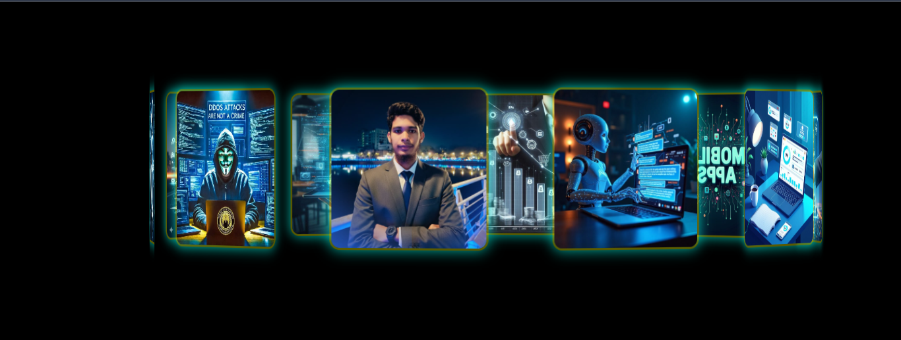

# 🌐 3D Image Carousel Page

An interactive **3D rotating image carousel landing page** built with pure HTML, CSS, and JavaScript.  
Features a smooth draggable 3D gallery with neon-style UI and responsive design.

---

## ✨ Preview



---

## 🚀 Features

- 🎡 3D rotating image carousel
- 🖱️ Mouse drag interaction
- ⚡ Smooth auto-rotation animation
- 💡 Neon glow UI design
- 📱 Fully responsive layout
- 🎨 Modern landing page sections
- 🧩 Pure HTML, CSS, JavaScript (no libraries)

---

## 📂 Project Structure

```bash
3D-Image-Carousel-Page
│
├── index.html
└── README.md
```

---

## 🛠️ How to Use

1. downlode https://github.com/mhhridoy7907/3D-Image-Carousel-Page

2. Open the folder

3. Run `im.html` in your browser

---

## 🎮 Interaction

- Drag mouse left/right → Rotate carousel  
- Auto-rotation runs continuously  
- Responsive on mobile & desktop  

---

## 📸 Images

Images used in this project are from Pinterest (for demo purposes only).

---

## 📜 License

This project is licensed under the MIT License — you are free to use and modify it.

---

## 👨‍💻 Author

**Murad Hasan Hridoy**  
🌍 Bangladesh  
💻 Web Developer | AI Enthusiast  

---

⭐ If you like this project, give it a star on GitHub!
